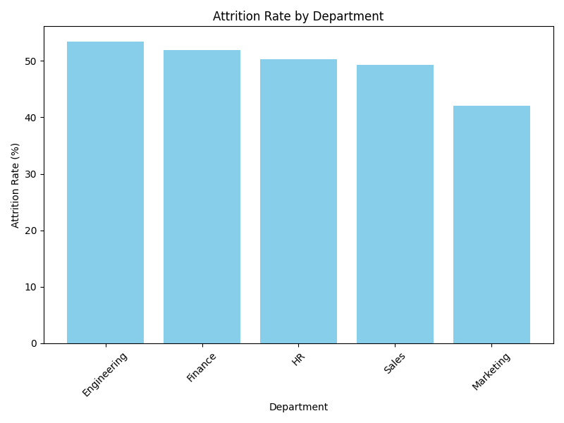
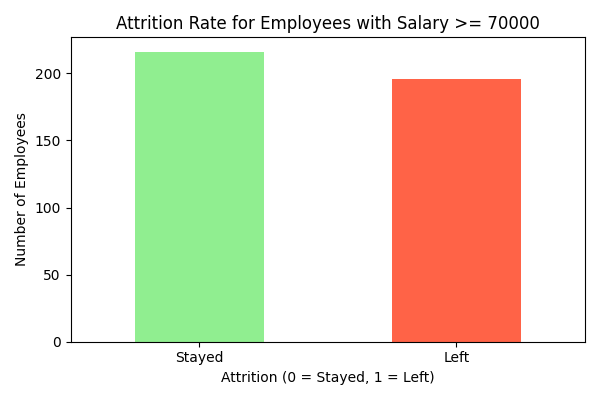

# Employee Retention Insights

## Project Overview
Employee Retention Insights is a comprehensive data analytics and machine learning project designed to analyze and predict employee attrition rates. By integrating detailed data analysis, predictive modeling, and API development, this project provides actionable insights for HR departments to improve employee retention.

## Key Features
- **Data Analysis**:
  - Visualize employee attrition rates across departments.
  - Analyze key factors influencing employee satisfaction and retention.
  - Generate actionable insights with comprehensive visualizations.
- **Machine Learning**:
  - Predict employee attrition using an XGBoost model.
  - Evaluate feature importance using Random Forest.
- **API Development**:
  - FastAPI endpoints for real-time attrition prediction.
  - Easily extendable API structure for further integration.

## Technologies Used
- **Programming Languages**: Python
- **Libraries**: Pandas, NumPy, Matplotlib, Seaborn, XGBoost, FastAPI
- **Visualization Tools**: Matplotlib, Seaborn
- **API Framework**: FastAPI
- **Other Tools**: Docker (planned), GitHub

## Project Structure
```
employee_retention_insights/
├── data/
│   ├── raw/                 # Raw dataset
│   ├── processed/           # Processed dataset and outputs
├── scripts/
│   ├── analysis.py          # Data analysis and visualization
│   ├── api.py               # FastAPI application
│   ├── data_processing.py   # Data preprocessing functions
│   ├── feature_importance.py# Feature importance calculation
│   ├── main.py              # Main execution script
│   ├── model_training.py    # Machine learning model training
│   └── visualizations.py    # Visualization utilities
├── requirements.txt         # Python dependencies
├── README.md                # Project documentation

```

## Setup and Usage
1. **Clone the repository**:
   ```bash
   git clone https://github.com/yourusername/employee_retention_insights.git
   cd employee_retention_insights
   ```
2. **Set up the environment**:
   ```bash
   python -m venv venv
   source venv/bin/activate   # On Windows: venv\Scripts\activate
   pip install -r requirements.txt
   ```
3. **Run data preprocessing**:
   ```bash
   python scripts/process_data.py
   ```
4. **Launch the API**:
   ```bash
   uvicorn scripts.api:app --reload
   ```
5. **Access the API**:
   Open your browser and navigate to `http://127.0.0.1:8000/docs` for the API documentation.

## Example Visualizations
### Attrition Distribution
This bar chart illustrates the attrition distribution across various departments. It highlights which departments experience higher turnover rates, allowing HR teams to focus on those areas for retention strategies.


### High Salary Attrition
This bar chart shows the attrition rates for employees with salaries >= 70,000. While high salaries often correlate with increased retention, this graph reveals that dissatisfaction or other factors can still lead to attrition, even among well-compensated employees.


## Additional Visualizations
More visualizations and insights can be found in the `images/` directory of this repository.

---

## API Endpoints
- `GET /`: Health check endpoint.
- `POST /predict`: Predict employee attrition based on input data.
  - **Request Body**:
    ```json
    {
      "Age": 35,
      "Gender": 1,
      "Satisfaction_Hours": 300.5,
      "Salary_Rank": "Medium",
      "Department_Attrition_Rate": 0.12,
      "Satisfaction_Tenure": 3.5,
      "Satisfaction_Per_Hour": 0.02
    }
    ```
  - **Response**:
    ```json
    {
      "Attrition Prediction": "Yes"
    }
    ```

## Why This Project?
This project is tailored for HR departments across Europe, addressing challenges in employee retention with data-driven insights and scalable solutions. It is particularly beneficial for industries with traditionally high attrition rates, such as retail, healthcare, and IT. By identifying key factors influencing employee satisfaction and attrition, organizations can implement targeted strategies to improve retention and reduce costs associated with turnover.

Additionally, the project is designed to integrate seamlessly with existing HR systems, enabling companies to make data-driven decisions at scale.


## Contact
If you are interested in this project or have any questions, feel free to connect with me on [LinkedIn](https://www.linkedin.com/in/yuka-yamaguchi-214290342).

---

This project demonstrates expertise in data analytics, machine learning, and API development, with a strong focus on practical applications for HR departments.
